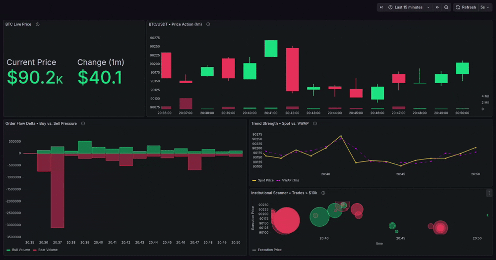
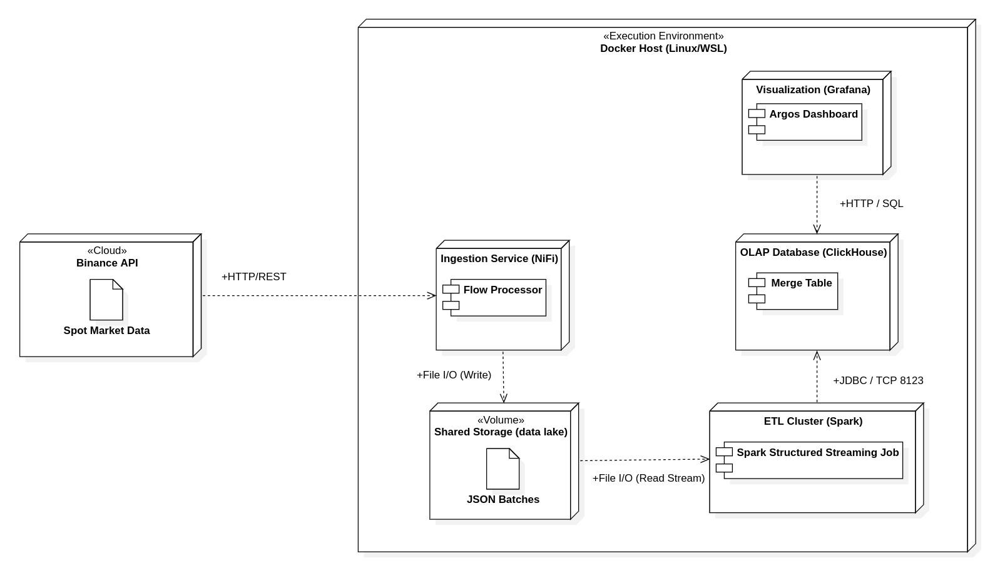

# Argos

**Real-Time Crypto Intelligence & Market Microstructure Pipeline.**

## About the Project

**Argos** is an open-source data engineering pipeline designed to capture, process, and visualize cryptocurrency market microstructure in real-time. Unlike standard trackers that only show price, Argos analyzes the underlying **Order Flow**, identifying aggressive buying/selling pressure and institutional movements ("Whales") with sub-second latency.

The system implements a robust **Lambda/Kappa Architecture** entirely on Docker, orchestrating **Apache NiFi** for ingestion, **Apache Spark (Structured Streaming)** for ETL processing, and **ClickHouse** for high-performance OLAP storage. The final output is an institutional-grade **Grafana** dashboard used for algorithmic trading analysis.

The project is named after Argos Panoptes, the hundred-eyed giant of Greek mythology, representing all-seeing vigilance over the market.

## Key Features

  - **Event-Driven Architecture:** End-to-end streaming pipeline handling continuous data ingestion from Binance API without data loss.
  - **Real-Time ETL:** Uses **Spark Structured Streaming** to transform raw JSON blobs into structured financial data, calculating timestamps and type casting on the fly.
  - **Whale Radar:** Algorithmic detection of high-value transactions (\>$10k) using logarithmic scaling to visualize institutional support/resistance zones.
  - **Market Microstructure Metrics:**
      - **Net Volume Flow:** Separates Taker Buy vs. Taker Sell volume to determine market aggression.
      - **VWAP Analysis:** Real-time comparison between Spot Price and Volume Weighted Average Price.
  - **Infrastructure as Code (IaC):** Automated deployment. Initialize the Data Base automatically. Includes a "Janitor" container that manages volume permissions dynamically and a "Driver" container that automatize the ETL process in Spark.

## Prerequisites

Before getting started, ensure you have the following installed:

1.  **Docker & Docker Compose**:

    Install Docker by following the official installation guide for your operating system: [Docker Installation Guide](https://docs.docker.com/get-docker/).

## Quick Start

> **⚠️ Important:** Steps 2 and 4 are **One-Time Setup** tasks. Docker Volumes will persist your NiFi Flow, ClickHouse Data, and Grafana Dashboard. You won't need to repeat them after restarts.

### 1. Launch Infrastructure

Run the complete stack in detached mode. This starts NiFi, ClickHouse, Spark Cluster, and Grafana.

```bash
docker compose up -d
```

### 2. Configure NiFi (Ingestion)

Since automation is disabled for security, import the flow manually:

1.  **Access UI:** https://localhost:8443 (User: `admin` / Pass: `Password123!`) Accept certificate warning.

2.  **Import Flow:** Drag a **Process Group** icon from the top toolbar onto the canvas. In the dialog, browse and select the file `nifi_flows/argos_ingestion.json`. Click **Add**.

### 3. Start NiFi Flow (Ingestion)

Using the NiFi UI (https://localhost:8443 User: `admin` / Pass: `Password123!`), click on the Process Group to select it. In the **Operation** floating menu (usually on the left), click the **Start** (Play) button.

### 4. Configure Grafana (Visualization)

Connect the visualization layer to the database:

1.  **Access UI:** http://localhost:3000 (User: `admin` / Pass: `Password123!`).

2.  **Add Data Source:** Go to *Connections* -> *Add new connection* -> Search for **ClickHouse**.

    * **Name:** Argos DB.
    * **Server address :** `clickhouse`.
    * **Port:** `8123`.
    * **Protocol:** `HTTP`.
    * **Username:** `default`.
    * **Password:** `Password123!`.
    * Click **Save & Test**.

3.  **Import Dashboard:** Go to *Dashboards* -> *New* -> *Import*. Upload the `dashboards/Argos-*.json` file.

### 4. Analyze the Binance Data

Access to the **Grafana UI** (http://localhost:3000 User: `admin` / Pass: `Password123!`) and open the **Argos Dashboard**. You will see Real-Time data represented with significant metrics and visualizations.

## Usage Guide

The Argos platform is divided into three logical layers, accessible via their respective web interfaces:

### 1. Ingestion Layer (Apache NiFi)

  * **URL:** http://localhost:8443
  * **Function:** Handles the connection to Binance API. It manages rate limits, buffers raw data, and handles back-pressure before sending data to the Data Lake.
  * **Status:** You should see the `argos_ingestion` Process Group in "RUNNING" state.

### 2. Processing Layer (Apache Spark)

  * **URL:** http://localhost:8080 (Spark Master UI)
  * **Function:** Visualizes the cluster status. You will see an application named `ArgosRealTime` in the "Running Applications" list.
  * **Logs:** To see the ETL in action, you can check the logs of the runner:

    ```bash
    docker logs -f argos_etl_runner
    ```

### 3. Intelligence Layer (Grafana Dashboard)

The main interface for analysis on http://localhost:3000. The dashboard is divided into diferent quadrants:

  * **🤑​ BTC Live Price:** Most recent execution price streamed from Binance.

  * **📈 BTC/USDT • Price Action (1m):** Real-time OHLCV (Open, High, Low, Close, Volume) chart aggregated by minute. Source: Binance WebSocket via NiFi & Spark Streaming. Visualizes market structure and immediate price trends.

  * **⚖️ Order Flow Delta • Buy vs. Sell Pressure:** Breakdown of Taker Volume (Aggressive Orders).
    - Green (Above 0): Aggressive Buys. Indicates demand absorption.
    - Red (Below 0): Aggressive Sells. Indicates supply dumping.

    Large bars suggest high conviction moves or stop-loss hunts.

  * **📉 Trend Strength • Spot vs. VWAP:** Volume Weighted Average Price (VWAP) acts as a dynamic benchmark.
    - Price > VWAP: Bullish Control (Buyers are paying above average).
    - Price < VWAP: Bearish Control (Sellers are dominating).

    The gap between Price and VWAP indicates trend momentum.

  * **🔭 Whale & Institutional Activity:** X-Axis: Time | Y-Axis: Execution Price | Size: Trade Value ($). Filters out retail noise to isolate large block trades ("Whales").
    - Green Bubbles: Large Buy Orders (Support zones).
    - Red Bubbles: Large Sell Orders (Resistance zones).

  Clustered bubbles indicate institutional accumulation or distribution areas.



## System Architecture



## Project Structure

The codebase is organized to separate infrastructure, logic, and configuration:

```text
argos/
├── docker-compose.yml        # Orchestration of all 7 services
├── architecture/
│   └── argos.mdj             # Architecture diagram implemented with StarUML
├── database/
│   └── init.sql              # ClickHouse table definitions (MergeTree)
├── etl/
│   └── etl_job.py            # PySpark Structured Streaming logic
├── nifi_flows/
│   ├── argos_ingestion.json  # NiFi Flow Definition
├── jars/
│   └── clickhouse-jdbc.jar   # JDBC Driver for Spark
├── dashboards/
│   └── Argos-*.json          # Grafana Dashboard
└── README.md                 # Documentation
```

## Developer Notes

### Fault Tolerance

The system uses a persistent volume for **Spark Checkpoints** (`spark_checkpoints`). If the container crashes or is restarted, the ETL job picks up exactly where it left off, ensuring **Exactly-Once** processing semantics.

### Permission Management

Since NiFi runs as user `1000` and Spark as user `185`, a transient container (`init-permissions`) runs at boot to reconcile ownership of the shared volumes (`data_lake`), preventing `Permission Denied` errors common in Dockerized data pipelines.

### Delete data

For deleting the storage Binance data on the Docker volumes, you can use this command:

```bash
docker volume rm argos_data_lake argos_spark_checkpoints argos_clickhouse_data
```

## License

This project is open source and available under the terms of the [GNU General Public License v3.0](https://www.gnu.org/licenses/gpl-3.0.html).
See the [LICENSE](LICENSE) file for the full text.

---

I hope this guide has been helpful!
